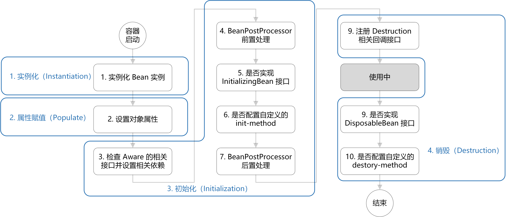

Bean的生命周期

> Spring 只帮我们管理单例模式Bean的完整生命周期，对于prototype的bean，Spring在创建好交给使用者后则不会再管理后续生命周期


概括来说有四个阶段：

实例化（Instantiation）

属性赋值（Populate）

初始化（Initialization）

销毁（Destruction）





```java
// AbstractAutowireCapableBeanFactory.java
// doCreateBean()
protected Object doCreateBean(final String beanName, final RootBeanDefinition mbd, final @Nullable Object[] args)
    throws BeanCreationException {
	// 1.实例化
    BeanWrapper instanceWrapper = null;
    if (instanceWrapper == null){
        instanceWrapper = createBeanInstance(beanName,mbd,args);
    }
    Object exposedObject = bean;
    try{
        // 2.属性赋值
        populateBean(beanName,mbd,instanceWrapper);
        // 3.初始化
        exposedObject = initializeBean(beanName,exposedObject,mbd);
    }
    // 4.销毁-注册回调接口
    try{
        registerDisposableBeanIfNecessary(beanName,beanmbd);
    }
    return exposedObject;

```


// 3.初始化

```java
// AbstractAutowireCapableBeanFactory.java
protected Object initializeBean(final String beanName, final Object bean, @Nullable RootBeanDefinition mbd) {
	// 3.检查Aware相关接口并设置相关依赖
    if (System.getSecurityManager() != null){
        AccessController.doPrivileged((PrivilegedAction<Object>)()->{
            invokeAwareMethods(beanNamebean);
            return null;
        },getAccessControlContext());
    }
    else{
        invokeAwareMethods(beanName,bean);
    }
    // 4.BeanPostProcessor 前置处理
    Object wrapperBean = bean;
    if (mbd == null || !mbd.isSynthetic()){
        wrappedBean = applyBeanPostProcessorsBeforeInitialization(wrappedBean,beanName);
    }
    // 5.若实现Initializing接口，调用afterPropertiesSet() 方法
    // 6.若配置自定义的init-method方法，则执行
    try {
        invokeInitMethods(beanName,wrappedbean,mbd);
    }
    catch (Throwable ex) {
        throw new BeanCreationException(
            (mbd != null ? mbd.getResourceDescription() : null),
            beanName, "Invocation of init method failed", ex);
    }
    // 7.BeanPostProcessor 后置处理
    if(mbd == null || !mbd.isSynthetic()){
        wrappedBean = applyBeanPostProcessorAfterInitialization(wrappedBean,beanName);
    }
    return wrappedBean;
    
```


// 4.销毁

```java
// DisposableBeanAdapter.java
public void destroy() {
	// 9.若实现DisposableBean接口，则执行destroy()方法
	if(this.invokeDisposableBean){
    	try{
        	if(System.getSecurityManager() != null){
            	AccessController.doPrivileged((PrivilegedExceptionAction<Object>)()->{
                	((DisposableBean) this.bean).destroy();
               	 return null;
            	},this.acc);
        	}
        	else{
            ((DisposableBean)this.bean).destroy();
        	}
    	}
	}   
    // 10.若配置自定义的destroy-method方法，则执行
    if(this.destroyMethod != null){
        invokeCustomDestroyMethod(this.destroyMethod);
    }
    else if (this.destroyMethodName !=null){
        Method methodToInvoke = determineDestroyMethod(this.destroyMethodName);
        if(methodToInvoke != null){
            invokeCustomDestroyMethod(ClassUtils.getInterfaceMethodIfPossible(methodToInvoke));
        }
    }
}
```


#### 扩展点

* Aware接口

在初始化过程的第3步也就是“检查Aware相关接口并设置相关依赖”，若Spring检测到bean实现了Aware接口，则会为其注入相应的依赖，所以通过让bean实现Aware接口，能在bean中获得相应的Spring容器资源

Spring中提供的Aware接口有：

1. BeanNameAware：注入当前bean对应的beanName；
2. BeanClassLoaderAware：注入加载当前bean的ClassLoader；
3. BeanFactoryAware：注入当前BeanFactory容器的引用

`invokeAwareMethods()` 的实现如下

```java
// AbstractAutowireCapableBeanFactory.java
private void invokeAwareMethods(final String beanName, final Object bean) {
    if (bean instanceof Aware) {
        if (bean instanceof BeanNameAware) {
            ((BeanNameAware) bean).setBeanName(beanName);
        }
        if (bean instanceof BeanClassLoaderAware) {
            ((BeanClassLoaderAware) bean).setBeanClassLoader(bcl);
            
        }
        if (bean instanceof BeanFactoryAware) {
            ((BeanFactoryAware) bean).setBeanFactory(AbstractAutowireCapableBeanFactory.this);
        }
    }
}
```


* BeanPostProcessor  增强处理器

> 注意前置和后置的位置是分开的
>
> 它们分别在任何bean初始化回调之前或之后执行（例如InitializingBean的afterPropertiesSet方法或自定义init-method方法之前或者之后）


```java
public interface BeanPostProcessor {

	// 初始化前置处理
	default Object postProcessBeforeInitialization(Object bean, String beanName) throws BeansException {
		return bean;
	}

	// 初始化后置处理
	default Object postProcessAfterInitialization(Object bean, String beanName) throws BeansException {
		return bean;
	}
}
```


* InitializingBean 和init-method

如果Bean类实现了InitializingBean 接口，则在设置了配置文件中定义的所有Bean属性后调用`afterPropertiesSet()`方法，在`afterPropertiesSet()`方法中写初始化逻辑

```java
public interface InitializingBean {
	void afterPropertiesSet() throws Exception;
}
```

如果配置文件中的Bean定义包含init-method属性，该属性的值将解析为Bean类中的方法名称，并将调用该方法

```xml
<?xml version="1.0" encoding="UTF-8"?>
<beans xmlns="http://www.springframework.org/schema/beans"
       xmlns:xsi="http://www.w3.org/2001/XMLSchema-instance"
       xsi:schemaLocation="http://www.springframework.org/schema/beans http://www.springframework.org/schema/beans/spring-beans.xsd">
    <bean id="demo" class="com.chaycao.Demo" init-method="init()"/>
</beans>
```


最后总结下如何记忆 Spring Bean 的生命周期：

- 首先是实例化、属性赋值、初始化、销毁这 4 个大阶段；
- 再是初始化的具体操作，有 Aware 接口的依赖注入、BeanPostProcessor 在初始化前后的处理以及 InitializingBean 和 init-method 的初始化操作；
- 销毁的具体操作，有注册相关销毁回调接口，最后通过DisposableBean 和 destory-method 进行销毁。


> 参考：[https://chaycao.github.io/2020/02/15/%E5%A6%82%E4%BD%95%E8%AE%B0%E5%BF%86Spring-Bean%E7%9A%84%E7%94%9F%E5%91%BD%E5%91%A8%E6%9C%9F/](https://chaycao.github.io/2020/02/15/如何记忆Spring-Bean的生命周期/)


---

自动装配

Spring框架的自动装配功能具有四种模式，分别是no、byName、byType和constructor


使用 `@Autowired` 注解来自动装配

* 其标注的属性必须是可装配的，如果没有Bean可以装配到`@Autowired` 标注的属性或参数中，那么会抛出 `NoSuchBeanDefinitionException` 的异常
* 装配策略：默认使用byType来装配属性，如果匹配到类型的多个实例，再通过byName来确定Bean


