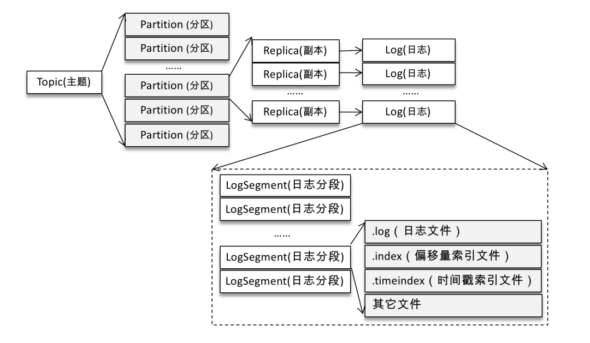
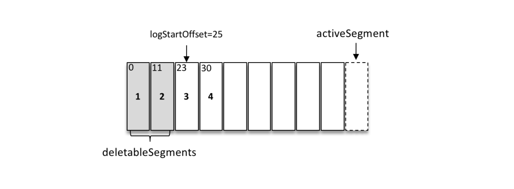
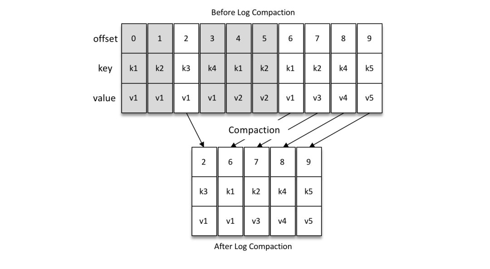
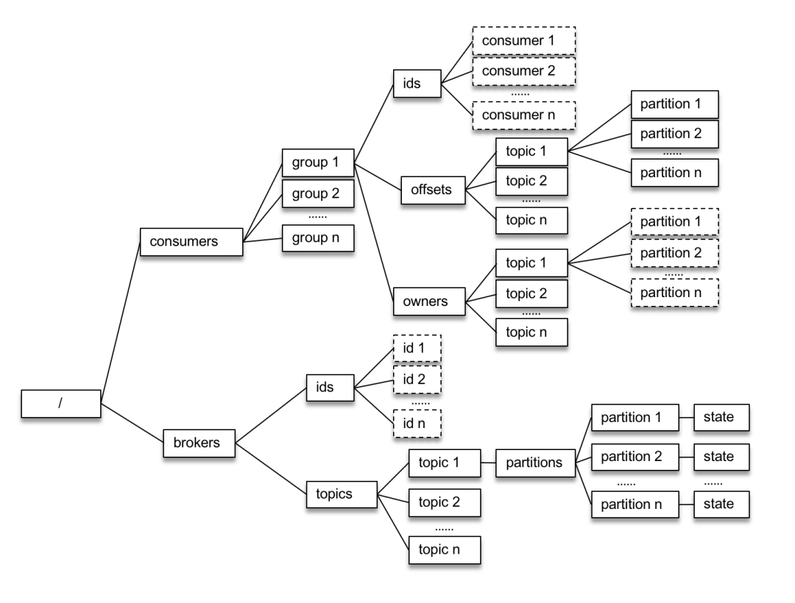
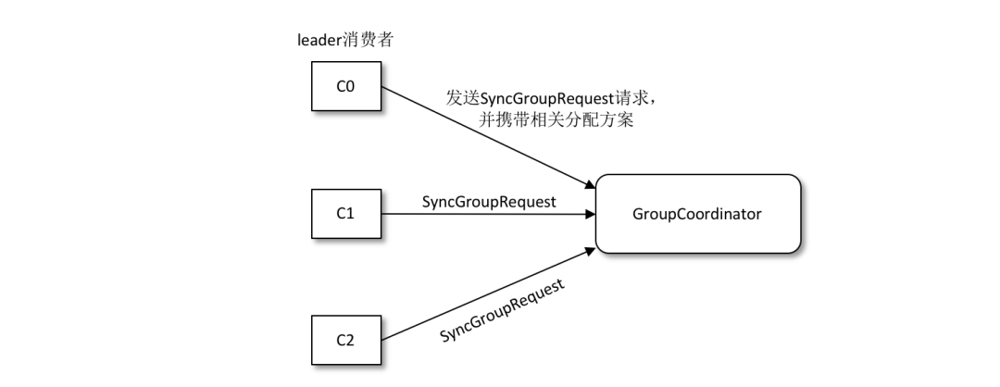

---

##### Kafka目前有哪些内部topic，各自作用

__consumer_offsets：用来保存Kafka消费者的位移信息

__transaction_state：用来存储事务日志消息

##### 优先副本是什么？作用？

优先副本是指在AR集合列表中的第一个副本；

理想情况下优先副本是该分区的leader副本，也可以称之为preferred leader，Kafka要确保所有主题的优先副本在Kafka集群中均匀分布，这样就保证了所有分区的leader均衡分布，以此来促进集群的负载均衡；

##### Kafka有哪些分区分配的概念？

1. 生产者的分区分配是指为每条消息指定其所要发往的分区，可以编写一个具体的类实现`org.apache.kafka.clients.producer.Partitioner` 接口；
2. 消费者中的分区分配是指为消费者指定其可以消费消息的分区，Kafka提供了消费者客户端参数`partition.assignment.strategy` 来设置消费者与订阅主题之间的分区分配策略；
3. 分区副本中的分配是指为集群制定创建主题时的分区副本分配方案，即在哪个broker中创建哪些分区的副本，kafka-topics.sh脚本中提供了`replica-assignment`参数来手动指定分区副本的分配方案；

##### Kafka的日志目录结构

Kafka中的消息是以主题为基本单位进行归类的，各个主题在逻辑上相互独立，每个主题可以分为一个或多个分区；不考虑多副本的情况，一个分区对应一个日志（Log），为了防止log过大，Kafka又引入了日志分段（LogSegment）的概念，将Log切分为多个LogSegment，相当于一个大文件被分为多个较小文件；

Log和LogSegment也不是纯粹物理意义的概念，Log在物理上以文件夹形式存储，而每个LogSegment对应于磁盘上一个日志文件和两个索引文件（.index，偏移量索引文件、.timeindex，时间戳索引文件）以及其他文件（比如以.txnindex为后缀的事务索引文件）；

##### Kafka中有哪些索引文件?

每个日志分段文件（LogSegment）对应于两个索引文件，主要用来提高查找消息的效率；

偏移量索引文件用来建立消息偏移量（offset）到物理地址之间的映射关系，方便快速定位消息所在物理位置；

时间戳索引文件则根据指定的时间戳（timestamp）来查找对应的偏移量信息；

##### Kafka怎么查找到指定offset对应的消息？

Kafka是通过seek()方法来指定消费的，在执行seek()方法之前要去执行一次poll()方法，等到分配到分区之后会去对应的分区的指定位置开始消费，如果指定的位置发生了越界，那么会根据`auto.offset.reset ` 参数设置的情况进行消费；

**Kafka怎么根据指定timestamp找到对应消息？**

Kafka提供了一个offsetsForTimes()方法，通过timestamp来查询与此对应的分区位置；offsetsForTimes() 方法的参数 timestampsToSearch 是一个 Map 类型，key 为待查询的分区，而 value 为待查询的时间戳，该方法会返回时间戳大于等于待查询时间的第一条消息对应的位置和时间戳，对应于 OffsetAndTimestamp 中的 offset 和 timestamp 字段。

### 聊一聊你对Kafka的Log Retention的理解

日志删除（Log Retention）：按照一定的保留策略直接删除不符合条件的日志分段。
我们可以通过 broker 端参数 log.cleanup.policy 来设置日志清理策略，此参数的默认值为“delete”，即采用日志删除的清理策略。

1. 基于时间
   日志删除任务会检查当前日志文件中是否有保留时间超过设定的阈值（retentionMs）来寻找可删除的日志分段文件集合（deletableSegments）retentionMs 可以通过 broker 端参数 log.retention.hours、log.retention.minutes 和 log.retention.ms 来配置，其中 log.retention.ms 的优先级最高，log.retention.minutes 次之，log.retention.hours 最低。默认情况下只配置了 log.retention.hours 参数，其值为168，故默认情况下日志分段文件的保留时间为7天。
   删除日志分段时，首先会从 Log 对象中所维护日志分段的跳跃表中移除待删除的日志分段，以保证没有线程对这些日志分段进行读取操作。然后将日志分段所对应的所有文件添加上“.deleted”的后缀（当然也包括对应的索引文件）。最后交由一个以“delete-file”命名的延迟任务来删除这些以“.deleted”为后缀的文件，这个任务的延迟执行时间可以通过 file.delete.delay.ms 参数来调配，此参数的默认值为60000，即1分钟。
2. 基于日志大小
   日志删除任务会检查当前日志的大小是否超过设定的阈值（retentionSize）来寻找可删除的日志分段的文件集合（deletableSegments）。
   retentionSize 可以通过 broker 端参数 log.retention.bytes 来配置，默认值为-1，表示无穷大。注意 log.retention.bytes 配置的是 Log 中所有日志文件的总大小，而不是单个日志分段（确切地说应该为 .log 日志文件）的大小。单个日志分段的大小由 broker 端参数 log.segment.bytes 来限制，默认值为1073741824，即 1GB。
   这个删除操作和基于时间的保留策略的删除操作相同。
3. 基于日志起始偏移量
   基于日志起始偏移量的保留策略的判断依据是某日志分段的下一个日志分段的起始偏移量 baseOffset 是否小于等于 logStartOffset，若是，则可以删除此日志分段。
   

如上图所示，假设 logStartOffset 等于25，日志分段1的起始偏移量为0，日志分段2的起始偏移量为11，日志分段3的起始偏移量为23，通过如下动作收集可删除的日志分段的文件集合 deletableSegments：

从头开始遍历每个日志分段，日志分段1的下一个日志分段的起始偏移量为11，小于 logStartOffset 的大小，将日志分段1加入 deletableSegments。
日志分段2的下一个日志偏移量的起始偏移量为23，也小于 logStartOffset 的大小，将日志分段2加入 deletableSegments。
日志分段3的下一个日志偏移量在 logStartOffset 的右侧，故从日志分段3开始的所有日志分段都不会加入 deletableSegments。
收集完可删除的日志分段的文件集合之后的删除操作同基于日志大小的保留策略和基于时间的保留策略相同

### 聊一聊你对Kafka的Log Compaction的理解

日志压缩（Log Compaction）：针对每个消息的 key 进行整合，对于有相同 key 的不同 value 值，只保留最后一个版本。
如果要采用日志压缩的清理策略，就需要将 log.cleanup.policy 设置为“compact”，并且还需要将 log.cleaner.enable （默认值为 true）设定为 true。

如下图所示，Log Compaction 对于有相同 key 的不同 value 值，只保留最后一个版本。如果应用只关心 key 对应的最新 value 值，则可以开启 Kafka 的日志清理功能，Kafka 会定期将相同 key 的消息进行合并，只保留最新的 value 值。

### 聊一聊你对Kafka底层存储的理解

#### 页缓存

页缓存是操作系统实现的一种主要的磁盘缓存，以此用来减少对磁盘 I/O 的操作。具体来说，就是把磁盘中的数据缓存到内存中，把对磁盘的访问变为对内存的访问。

当一个进程准备读取磁盘上的文件内容时，操作系统会先查看待读取的数据所在的页（page）是否在页缓存（pagecache）中，如果存在（命中）则直接返回数据，从而避免了对物理磁盘的 I/O 操作；如果没有命中，则操作系统会向磁盘发起读取请求并将读取的数据页存入页缓存，之后再将数据返回给进程。

同样，如果一个进程需要将数据写入磁盘，那么操作系统也会检测数据对应的页是否在页缓存中，如果不存在，则会先在页缓存中添加相应的页，最后将数据写入对应的页。被修改过后的页也就变成了脏页，操作系统会在合适的时间把脏页中的数据写入磁盘，以保持数据的一致性。

用过 Java 的人一般都知道两点事实：对象的内存开销非常大，通常会是真实数据大小的几倍甚至更多，空间使用率低下；Java 的垃圾回收会随着堆内数据的增多而变得越来越慢。基于这些因素，使用文件系统并依赖于页缓存的做法明显要优于维护一个进程内缓存或其他结构，至少我们可以省去了一份进程内部的缓存消耗，同时还可以通过结构紧凑的字节码来替代使用对象的方式以节省更多的空间。

此外，即使 Kafka 服务重启，页缓存还是会保持有效，然而进程内的缓存却需要重建。这样也极大地简化了代码逻辑，因为维护页缓存和文件之间的一致性交由操作系统来负责，这样会比进程内维护更加安全有效。

#### 零拷贝

除了消息顺序追加、页缓存等技术，Kafka 还使用零拷贝（Zero-Copy）技术来进一步提升性能。所谓的零拷贝是指将数据直接从磁盘文件复制到网卡设备中，而不需要经由应用程序之手。零拷贝大大提高了应用程序的性能，减少了内核和用户模式之间的上下文切换。对 Linux 操作系统而言，零拷贝技术依赖于底层的 sendfile() 方法实现。对应于 Java 语言，FileChannal.transferTo() 方法的底层实现就是 sendfile() 方法。

### 聊一聊Kafka的延时操作的原理

Kafka 中有多种延时操作，比如延时生产，还有延时拉取（DelayedFetch）、延时数据删除（DelayedDeleteRecords）等。
延时操作创建之后会被加入延时操作管理器（DelayedOperationPurgatory）来做专门的处理。延时操作有可能会超时，每个延时操作管理器都会配备一个定时器（SystemTimer）来做超时管理，定时器的底层就是采用时间轮（TimingWheel）实现的。

### 聊一聊Kafka控制器的作用

在 Kafka 集群中会有一个或多个 broker，其中有一个 broker 会被选举为控制器（Kafka Controller），它负责管理整个集群中所有分区和副本的状态。当某个分区的 leader 副本出现故障时，由控制器负责为该分区选举新的 leader 副本。当检测到某个分区的 ISR 集合发生变化时，由控制器负责通知所有broker更新其元数据信息。当使用 kafka-topics.sh 脚本为某个 topic 增加分区数量时，同样还是由控制器负责分区的重新分配。

### Kafka的旧版Scala的消费者客户端的设计有什么缺陷？

如上图，旧版消费者客户端每个消费组（）在 ZooKeeper 中都维护了一个 /consumers//ids 路径，在此路径下使用临时节点记录隶属于此消费组的消费者的唯一标识（consumerIdString），/consumers//owner 路径下记录了分区和消费者的对应关系，/consumers//offsets 路径下记录了此消费组在分区中对应的消费位移。

每个消费者在启动时都会在 /consumers//ids 和 /brokers/ids 路径上注册一个监听器。当 /consumers//ids 路径下的子节点发生变化时，表示消费组中的消费者发生了变化；当 /brokers/ids 路径下的子节点发生变化时，表示 broker 出现了增减。这样通过 ZooKeeper 所提供的 Watcher，每个消费者就可以监听消费组和 Kafka 集群的状态了。

这种方式下每个消费者对 ZooKeeper 的相关路径分别进行监听，当触发再均衡操作时，一个消费组下的所有消费者会同时进行再均衡操作，而消费者之间并不知道彼此操作的结果，这样可能导致 Kafka 工作在一个不正确的状态。与此同时，这种严重依赖于 ZooKeeper 集群的做法还有两个比较严重的问题。

1. 羊群效应（Herd Effect）：所谓的羊群效应是指ZooKeeper 中一个被监听的节点变化，大量的 Watcher 通知被发送到客户端，导致在通知期间的其他操作延迟，也有可能发生类似死锁的情况。
2. 脑裂问题（Split Brain）：消费者进行再均衡操作时每个消费者都与 ZooKeeper 进行通信以判断消费者或broker变化的情况，由于 ZooKeeper 本身的特性，可能导致在同一时刻各个消费者获取的状态不一致，这样会导致异常问题发生。

### 消费再均衡的原理是什么？（提示：消费者协调器和消费组协调器）

就目前而言，一共有如下几种情形会触发再均衡的操作：

- 有新的消费者加入消费组。
- 有消费者宕机下线。消费者并不一定需要真正下线，例如遇到长时间的GC、网络延迟导致消费者长时间未向 GroupCoordinator 发送心跳等情况时，GroupCoordinator 会认为消费者已经下线。
- 有消费者主动退出消费组（发送 LeaveGroupRequest 请求）。比如客户端调用了 unsubscrible() 方法取消对某些主题的订阅。
- 消费组所对应的 GroupCoorinator 节点发生了变更。
- 消费组内所订阅的任一主题或者主题的分区数量发生变化。

GroupCoordinator 是 Kafka 服务端中用于管理消费组的组件。而消费者客户端中的 ConsumerCoordinator 组件负责与 GroupCoordinator 进行交互。

#### 第一阶段（FIND_COORDINATOR）

消费者需要确定它所属的消费组对应的 GroupCoordinator 所在的 broker，并创建与该 broker 相互通信的网络连接。如果消费者已经保存了与消费组对应的 GroupCoordinator 节点的信息，并且与它之间的网络连接是正常的，那么就可以进入第二阶段。否则，就需要向集群中的某个节点发送 FindCoordinatorRequest 请求来查找对应的 GroupCoordinator，这里的“某个节点”并非是集群中的任意节点，而是负载最小的节点。

#### 第二阶段（JOIN_GROUP）

在成功找到消费组所对应的 GroupCoordinator 之后就进入加入消费组的阶段，在此阶段的消费者会向 GroupCoordinator 发送 JoinGroupRequest 请求，并处理响应。

选举消费组的leader
如果消费组内还没有 leader，那么第一个加入消费组的消费者即为消费组的 leader。如果某一时刻 leader 消费者由于某些原因退出了消费组，那么会重新选举一个新的 leader

选举分区分配策略

1. 收集各个消费者支持的所有分配策略，组成候选集 candidates。
2. 每个消费者从候选集 candidates 中找出第一个自身支持的策略，为这个策略投上一票。
3. 计算候选集中各个策略的选票数，选票数最多的策略即为当前消费组的分配策略。

#### 第三阶段（SYNC_GROUP）

leader 消费者根据在第二阶段中选举出来的分区分配策略来实施具体的分区分配，在此之后需要将分配的方案同步给各个消费者，通过 GroupCoordinator 这个“中间人”来负责转发同步分配方案的。

#### 第四阶段（HEARTBEAT）

进入这个阶段之后，消费组中的所有消费者就会处于正常工作状态。在正式消费之前，消费者还需要确定拉取消息的起始位置。假设之前已经将最后的消费位移提交到了 GroupCoordinator，并且 GroupCoordinator 将其保存到了 Kafka 内部的 __consumer_offsets 主题中，此时消费者可以通过 OffsetFetchRequest 请求获取上次提交的消费位移并从此处继续消费。

消费者通过向 GroupCoordinator 发送心跳来维持它们与消费组的从属关系，以及它们对分区的所有权关系。只要消费者以正常的时间间隔发送心跳，就被认为是活跃的，说明它还在读取分区中的消息。心跳线程是一个独立的线程，可以在轮询消息的空档发送心跳。如果消费者停止发送心跳的时间足够长，则整个会话就被判定为过期，GroupCoordinator 也会认为这个消费者已经死亡，就会触发一次再均衡行为。

### Kafka中的幂等是怎么实现的？

为了实现生产者的幂等性，Kafka 为此引入了 producer id（以下简称 PID）和序列号（sequence number）这两个概念。

每个新的生产者实例在初始化的时候都会被分配一个 PID，这个 PID 对用户而言是完全透明的。对于每个 PID，消息发送到的每一个分区都有对应的序列号，这些序列号从0开始单调递增。生产者每发送一条消息就会将 <PID，分区> 对应的序列号的值加1。

broker 端会在内存中为每一对 <PID，分区> 维护一个序列号。对于收到的每一条消息，只有当它的序列号的值（SN_new）比 broker 端中维护的对应的序列号的值（SN_old）大1（即 SN_new = SN_old + 1）时，broker 才会接收它。如果 SN_new< SN_old + 1，那么说明消息被重复写入，broker 可以直接将其丢弃。如果 SN_new> SN_old + 1，那么说明中间有数据尚未写入，出现了乱序，暗示可能有消息丢失，对应的生产者会抛出 OutOfOrderSequenceException，这个异常是一个严重的异常，后续的诸如 send()、beginTransaction()、commitTransaction() 等方法的调用都会抛出 IllegalStateException 的异常。

