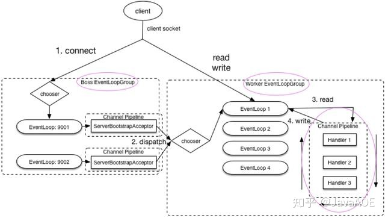

Netty学习

---

1. Netty是什么？

   Netty是一个基于NIO开发的网络通信框架

2. Netty的优点

   * 统一的API，支持多种传输类型，阻塞和非阻塞的
   * 强大的线程模型
   * 自带编解码器，解决TCP粘包、拆包问题
   * 各种协议栈
   * 无连接数据包套接字支持
   * 比直接使用Java核心API有更高的吞吐量、更低的延迟、更低的资源消耗和更少的内存复制

3. Netty的应用场景

   * 作为RPC框架的网络通信工具：在分布式系统中，不同服务节点之间经常需要相互调用；

   * 实现一个自己的HTTP服务器
   * 实现一个即时通讯系统
   * 实现消息推送系统，等等

4. Netty核心组件有哪些？作用有什么？

   * Channel

     Channel接口是Netty对网络操作的抽象，包括基本的I/O操作，如bind()、connect()、read()、write()等；

     比较常用的Channel接口实现类是NioServerSocketChannel（服务端）和NioSocketChannel（客户端）；

   * EventLoop

     > 用于处理 “连接”的生命周期中所发生的事件

     主要作用是负责监听网络事件并调用事件处理器进行相关I/O操作；

   * ChannelFuture

     Netty是异步非阻塞的，所有的I/O操作都是异步的，所以不能like得到操作是否执行成功的结果，这时可以通过ChannelFuture接口的addListener()方法注册一个ChannelFutureListener，操作成功或失败时，监听就会自动触发返回结果；

     ChannelFuture接口的sync()方法可以让异步操作变为同步；

   * ChannelHandler和ChannelPipeline

     ChannelHandler是消息的具体处理器，负责处理读写操作、客户端连接等；

     ChannelPipeline为ChannelHandler的链，提供了一个容器并定义了用于沿着链传播入站和出站事件流的API，当Channel被创建时，它会被自动分配到它专属的ChannelPipeline；

     可以在ChannelPipeline上通过addLast()添加ChannelHandler，因为一个数据或事件可能被多个Handler处理；

5. EventLoopGroup是什么？和EventLoop什么关系？

   

   

   * EventLoopGroup包含多个EventLoop（每一个EventLoop通常内部包含一个线程），Thread和EventLoop属于1:1的关系，从而保证线程安全；

   * 当客户端通过connect()连接服务端时，BossLoopGroup处理客户端连接请求，当BossLoopGroup处理完成后，会将这个连接提交给workerLoopGroup来处理IO相关操作；

6. Bootstrap和ServerBootstrap是什么？

   * Bootstrap是客户端的启动引导类；

   ```java
   EventLoopGroup group = new NioEventLoopGroup();
   try{
       // 创建客户端启动引导类：Bootstrap
       Bootstrap b = new Bootstrap();
       // 指定线程模型
       b.goup(group).……;
       // 尝试建立连接
       ChannelFuture f = b.connect(host,port).sync();
       f.channel().closeFuture().sync();
   }finally{
       // 关闭相关线程组资源
       group.shutdownGracefully();
   }
   ```

   

   * ServerBootstrap是服务端的启动引导类；

   ```java
   EventLoopGroup bossGroup = new NioEventLoopGroup(1);
   EventLoopGroup workGroup = new NioEventLoopGroup();
   try{
       // 创建服务端启动类：ServerBootstrap
       ServerBootstrap b = new ServerBootstrap();
       // 给引导类配置线程组，确定线程模型
       b.goup(bossGroup,workGroup).……;
       // 绑定端口
       ChannelFuture f = b.bind(port).sync();
       // 等待连接关闭
       f.channel().closeFuture().sync();
   }finally{
       // 关闭线程组资源
       bossGroup.shutdownGracefully();
       workGroup.shutdownGracefully();
   }
   ```

   * Bootstrap通常使用connect()方法连接到远程的主机和端口，作为一个Netty TCP协议通信中的客户端；另外Bootstrap也可以通过bind()方法绑定本地的一个端口，作为UDP协议通信中的一端；

   * ServerBootstrap通常使用bind()绑定本地的端口，然后等待客户端 的连接；
   * Bootstrap只需配置一个线程组，而ServerBootstrap需要配置两个线程组；

7. NioEventLoopGroup默认的构造函数会起多少个线程？

   结论：NioEventLoopGroup默认的构造函数会起CPU核数*2个；

   ```java
       public NioEventLoopGroup() {
           //调用下一个构造方法
           this(0);
       }
       public NioEventLoopGroup(int nThreads) {
           //继续调用下一个构造方法
           this(nThreads, (Executor) null);
       }
       /**
        * RejectedExecutionHandler（）：RejectedExecutionHandlers.reject()
        */
       public NioEventLoopGroup(int nThreads, Executor executor, final SelectorProvider selectorProvider,final SelectStrategyFactory selectStrategyFactory) {
          //开始调用父类的构造函数
           super(nThreads, executor, selectorProvider, selectStrategyFactory, RejectedExecutionHandlers.reject());
       }
   
   // 在MultithreadEventLoopGroup 类中
       // 从1，系统属性，CPU核心数*2 这三个值中取出一个最大的
       //可以得出 DEFAULT_EVENT_LOOP_THREADS 的值为CPU核心数*2
       private static final int DEFAULT_EVENT_LOOP_THREADS = Math.max(1, SystemPropertyUtil.getInt("io.netty.eventLoopThreads", NettyRuntime.availableProcessors() * 2));
   
       // 被调用的父类构造函数，NioEventLoopGroup 默认的构造函数会起多少线程的秘密所在
       // 当指定的线程数nThreads为0时，使用默认的线程数DEFAULT_EVENT_LOOP_THREADS
       protected MultithreadEventLoopGroup(int nThreads, ThreadFactory threadFactory, Object... args) {
           super(nThreads == 0 ? DEFAULT_EVENT_LOOP_THREADS : nThreads, threadFactory, args);
       }
   ```

   

8. Netty线程模型是什么样的？

   大部分是基于Reactor模式设计开发的

   > Reactor模式基于事件驱动，采用多路复用将事件分发给相应的Handler处理，非常适合处理海量IO的场景

   在Netty主要靠NioEventLoopGroup线程池来实现具体的线程模型；

   * 单线程模型：

     一个线程需要处理所有的accept、read、decode、process、encode、send事件；对于高负载、高并发或对性能要求比较高的场景不适用；

     ```
     EventLoopGroup eventGroup = new NioEventLoopGroup(1);
     ```

   * 多线程模型：

     一个Acceptor线程只负责监听客户端的连接，一个NIO线程池负责具体处理：accept、read、decode、process、encode、send 事件。满足绝大部分应用场景，并发连接量不大的时候没啥问题，但是遇到并发连接大的时候就可能会出现问题，成为性能瓶颈；

     ```java
     // 1.bossGroup 用于接收连接，workerGroup 用于具体的处理
     EventLoopGroup bossGroup = new NioEventLoopGroup(1);
     EventLoopGroup workerGroup = new NioEventLoopGroup();
     ```

   * 主从多线程模型：
     从一个主线程NIO线程池中选择一个线程作为Acceptor线程，绑定监听端口，接收客户端的连接，其他线程负责后续的接入认证等工作；连接建立完后，Sub NIO线程池负责具体IO读写；

     ```java
     // 1.bossGroup 用于接收连接，workerGroup 用于具体的处理
     EventLoopGroup bossGroup = new NioEventLoopGroup();
     EventLoopGroup workerGroup = new NioEventLoopGroup();
     ```

9. Netty服务端和客户端的启动过程是怎样的？

   * 服务端的创建过程：

     * 首先创建了两个NioEventLoopGroup对象：bossGroup和workerGroup

       bossGroup : 用于处理客户端的 TCP 连接请求；

       workerGroup ：负责每一条连接的具体读写数据的处理逻辑，真正负责 I/O 读写操作，交由对应的 Handler 处理；

     * 接下来创建一个服务端启动类：ServerBootstrap，这个类引导我们进行服务端的启动工作；

     * 通过.group()给引导类配置两个线程组，确定线程模型；

     * 通过channel()给引导类ServerBootstrap指定了IO模型为NIO

       NioServerSocketChannel ：指定服务端的 IO 模型为 NIO，与 BIO 编程模型中的ServerSocket对应；

       NioSocketChannel : 指定客户端的 IO 模型为 NIO， 与 BIO 编程模型中的Socket对应；

     * 通过.childHandler()给引导类创建一个ChannelInitializer，然后制定了服务端消息的业务处理逻辑；

     * 调用ServerBootstrap类的bind()方法绑定端口；

       ```java
       // 1.bossGroup 用于接收连接，workerGroup 用于具体的处理
               EventLoopGroup bossGroup = new NioEventLoopGroup(1);
               EventLoopGroup workerGroup = new NioEventLoopGroup();
               try {
                   //2.创建服务端启动引导/辅助类：ServerBootstrap
                   ServerBootstrap b = new ServerBootstrap();
                   //3.给引导类配置两大线程组,确定了线程模型
                   b.group(bossGroup, workerGroup)
                           // (非必备)打印日志
                           .handler(new LoggingHandler(LogLevel.INFO))
                           // 4.指定 IO 模型
                           .channel(NioServerSocketChannel.class)
                           .childHandler(new ChannelInitializer<SocketChannel>() {
                               @Override
                               public void initChannel(SocketChannel ch) {
                                   ChannelPipeline p = ch.pipeline();
                                   //5.可以自定义客户端消息的业务处理逻辑
                                   p.addLast(new HelloServerHandler());
                               }
                           });
                   // 6.绑定端口,调用 sync 方法阻塞知道绑定完成
                   ChannelFuture f = b.bind(port).sync();
                   // 7.阻塞等待直到服务器Channel关闭(closeFuture()方法获取Channel 的CloseFuture对象,然后调用sync()方法)
                   f.channel().closeFuture().sync();
               } finally {
                   //8.优雅关闭相关线程组资源
                   bossGroup.shutdownGracefully();
                   workerGroup.shutdownGracefully();
               }
       ```

       

   * 客户端：

     * 创建一个 NioEventLoopGroup 对象实例；

     * 创建客户端启动的引导类是 Bootstrap；

     * 通过 .group() 方法给引导类 Bootstrap 配置一个线程组；

     * 通过channel()方法给引导类 Bootstrap指定了 IO 模型为NIO；

     * 通过 .childHandler()给引导类创建一个ChannelInitializer ，然后制定了客户端消息的业务处理逻辑 HelloClientHandler 对象；

     * 调用 Bootstrap 类的 connect()方法进行连接，这个方法需要指定两个参数：inetHost：ip地址、inetPort：端口号；connect()方法返回一个Future类型的对象，通过addListener方法可以监听到连接是否成功；

       ```java
               //1.创建一个 NioEventLoopGroup 对象实例
               EventLoopGroup group = new NioEventLoopGroup();
               try {
                   //2.创建客户端启动引导/辅助类：Bootstrap
                   Bootstrap b = new Bootstrap();
                   //3.指定线程组
                   b.group(group)
                           //4.指定 IO 模型
                           .channel(NioSocketChannel.class)
                           .handler(new ChannelInitializer<SocketChannel>() {
                               @Override
                               public void initChannel(SocketChannel ch) throws Exception {
                                   ChannelPipeline p = ch.pipeline();
                                   // 5.这里可以自定义消息的业务处理逻辑
                                   p.addLast(new HelloClientHandler(message));
                               }
                           });
                   // 6.尝试建立连接
                   ChannelFuture f = b.connect(host, port).sync();
                   // 7.等待连接关闭（阻塞，直到Channel关闭）
                   f.channel().closeFuture().sync();
               } finally {
                   group.shutdownGracefully();
               }
       ```

10. TCP粘包、拆包的解决办法

    * 使用Netty自带的解码器
      * LineBasedFrameDecoder：发送端发送数据包时，每个数据包之间以换行符作为分隔，它的工作原理是依次遍历ByteBuffer中的可读字节，判断是否有换行符，然后进行相应截取；
      * DelimiterBasedFrameDecoder：可以自定义分隔符解码器；
      * FixedLengthFrameDecoder：固定长度解码器，它能够按照指定的长度对消息进行相应拆分；
      * LengthFieldBasedFrameDecoder：将消息分为消息头和消息体；
    * 自定义序列化编解码器

11. TCP长连接和短连接

    TCP 在进行读写之前，server 与 client 之间必须提前建立一个连接。建立连接的过程，需要我们常说的三次握手，释放/关闭连接的话需要四次挥手。这个过程是比较消耗网络资源并且有时间延迟的。

    所谓，短连接说的就是 server 端 与 client 端建立连接之后，读写完成之后就关闭掉连接，如果下一次再要互相发送消息，就要重新连接。短连接的优点很明显，就是管理和实现都比较简单，缺点也很明显，每一次的读写都要建立连接必然会带来大量网络资源的消耗，并且连接的建立也需要耗费时间。

    长连接说的就是 client 向 server 双方建立连接之后，即使 client 与 server 完成一次读写，它们之间的连接并不会主动关闭，后续的读写操作会继续使用这个连接。长连接的可以省去较多的 TCP 建立和关闭的操作，降低对网络资源的依赖，节约时间。对于频繁请求资源的客户来说，非常适用长连接。

12. 为什么需要心跳机制？Netty中心跳机制什么样？

    * 在TCP保持长连接的过程中，可能会出现网络异常，发生异常时，client与server之间没有交互的话是无法发现对方已掉线的，所以有了心跳机制；

    * 心跳机制的工作原理：

      在client和server之间在一定时间内没有数据交互时，即处于idle状态时，客户端或服务器就会发生一个特殊的数据包给对方，当接收方收到这个数据报文后，会回应发送方，即一个PING-PONG交互，这确保了TCP连接的有效性；

      TCP实际上自带的就有长连接选项，本身也有心跳包机制：SO_KEEPALIVE，（但是TCP协议层面的长连接不够灵活）一般情况下都是在应用层协议上实现自定义心跳机制，Netty实现心跳机制的核心类是IdleStateHandler；

13. Netty的零拷贝

    > 零拷贝技术是指计算机执行操作时，CPU不需要先将数据从某处内存复制到另一特定区域，这种技术通常用于通过网络传输文件时节省CPU周期和内存带宽

    在OS层面上的零拷贝通常指避免在用户态（User-space）与内核态（Kernel-space）之间来回拷贝数据

    Netty中的零拷贝主要体现在以下：

    * 使用Netty提供的CompositeByteBuf类，可以将多个ByteBuf合并为一个逻辑上的ByteBuf，避免了各个ByteBuf之间的拷贝；
    * ByteBuf支持slice操作，因此可以将ByteBuf分解为多个共享同一个存储区域的ByteBuf，避免了内存的拷贝；
    * 通过FileRegion包装的FileChannel.tranferTo实现文件传输，可以直接将文件缓冲区的数据发送到目标Channel，避免了传统通过循环write方式导致的内存拷贝问题；

14. 

15. 

    


常用类的意义

```java
NioSocketChannel;//异步的客户端 TCPSocket 连接。
NioServerSocketChannel;//异步的服务器端 TCP Socket 连接。
NioDatagramChannel;//异步的 UDP 连接。
NioSctpChannel;//异步的客户端 Sctp 连接。
NioSctpServerChannel;//异步的 Sctp 服务器端连接，这些通道涵盖了UDP和TCP网络IO以及文件IO
```


**Selector**

Netty基于Selector实现I/O多路复用，通过Selector一个线程可以监听多个连接的Channel事件，当向一个Selector中注册Channel后，Selector内部不断select这些Channel是否有已就绪的I/O事件，这样就可以使用一个线程管理多个Channel。

**NioEventLoop**

（Nio事件循环）其中维护了一个线程和任务队列，支持异步提交执行任务，线程启动时会调用NioEventLoop的run方法，执行I/O任务和非I/O任务：I/O任务，即selectionKey中ready的事件，如accept、connect、read、write等，由processSelectedKeys方法触发；非IO任务，即添加到taskQueue中的任务，如register0、bind0等，由runAllTasks方法触发

**NioEventLoopGroup**

事件循环的组，主要管理eventLoop的生命周期，类似于一个线程池，内部维护一组线程；

**ChannelHandler**

是一个接口，处理IO事件或拦截IO操作，并将其转发到ChannelPipeline（业务处理链）中的下一个处理程序，**ChannelInboundHandler** 用于处理入站IO事件，**ChannelOutboundHandler**用于处理出站IO事件。

**ChannelHandlerContext**

保存Channel相关的所有上下文信息，同时关联一个ChannelHandler对象

**ChannelPipeline**

保存**ChannelHandler**的list，用于处理或拦截Channel的入站事件和出站操作，内部是一个双向链表

**ChannelGroup**

线程安全的组件，存储了已连接的Channel，Channel关闭会自动从ChannelGroup中移除，无需担心Channel生命周期，可以对这些Channel做各种批量操作，以广播形式发送一条消息给所有Channels，调用它的writeAndFlush方法来实现；底层通过ConcurrentHashMap进行存储Channel的；

**Channel**

在netty中是通道接口，Netty实现的客户端NIO套接字通道是NioSocketChannel，提供的服务器端NIO套接字通道为NioServerSocketChannel


##### ChannelOption的各种属性

> https://blog.csdn.net/BanketBoy/article/details/86701969

`ChannelOption.SO_BACKLOG` 对应的是tcp/ip协议listen函数中backlog参数，函数listen(int socketfd,int backlog)用来初始化服务端可连接队列；服务端处理客户端连接请求是顺序处理的，所以同一时间多个客户端请求时，服务端将不能处理的客户端连接请求放在队列中等待，backlog参数指定了队列的大小；

`ChannelOption.SO_KEEPALIVE` 设置该选项后，如果两个小时内没有数据通信，TCP会自动发送活动探测数据报文；


