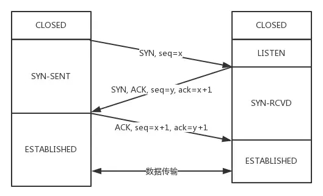
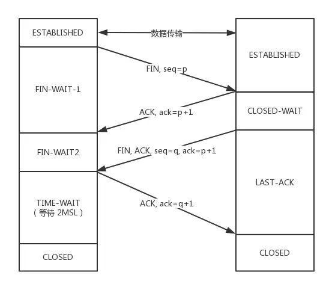

## TCP/IP面试题

> https://zhuanlan.zhihu.com/p/108822858

### TCP和UDP的区别

UDP 用户数据报协议（User Datagram Protocol）：是无连接的，没有拥塞控制，面向报文；

TCP 传输控制协议（Transmission Control Protocol）：面向连接，提供可靠交付，有流量控制、拥塞控制，提供全双工通信，面向字节流，每一条TCP连接只能是一对一的


#### UDP、TCP 首部格式

UDP首部字段只有8个字节，包括源端口、目的端口、长度、检验和（12字节的伪首部是为了计算检验和临时添加的）

TCP首部包括序号（用于对字节流进行编号）、确认号（期望收到的下一个报文段的序号）、数据偏移（数据部分距离报文段起始处的偏移量）、8位的控制位（CWR、ECE、URG、ACK、PSH、RST、SYN、FIN）、窗口（窗口值作为接收方让发送方设置其发送窗口的依据）


### 建立连接三次握手





需要三次握手的原因是：需要确认双方的发送数据能力和接收能力。

服务端开始监听某个端口后进入 `Listen` 状态；

客户端主动发起连接，发送SYN，进入 `SYN-SENT` 状态；

服务端收到后，返回`SYN ` 和 `ACK` （对应客户端发来的SYN），自己变成 `SYN-REVD` ；

客户端收到服务端的SYN和ACK后再发送ACK给服务端，自己进入ESTABLISHED状态；

服务端收到ACK后也进入ESTABLISHED 状态；

连接建立。


**三次握手过程中可以携带数据吗？**

第三次握手可以携带，因为第三次握手的时候，客户端已经处于ESTABLISHED状态，并且能够确认服务器的接收和发送能力，这时比较安全，可以携带数据。


##### 为什么需要3次握手呢？

3次握手的作用就是明确双方都具有收发能力


### 断开连接四次挥手




开始时双方都处于 ESTABLISHED 状态，客户端要断开连接，向服务端发送FIN报文，发送后客户端进入 FIN-WAIT-1状态，这时客户端也变成了half-close（半关闭）状态，即不能向服务端发送报文，只能接收；

服务端接收到客户端的FIN报文后，向客户端确认，变成CLOSE-WAIT 状态；

客户端接收到服务端的确认后变成FIN-WAIT-2状态；

随后，服务端向客户端发送FIN，自己进入LAST-ACK状态；

客户端收到服务端的FIN后，进入TIME-WAIT状态，然后发送ACK给服务端，这时，客户端需要等待2个MSL（报文最大生存时间），在这段时间内，如果客户端没有收到服务端的重发请求，那么表示ACK成功到达，挥手结束，否则，客户端重发ACK。


**为什么等待2个MSL？**

1个MSL确保四次挥手中主动关闭方最后的ACK报文最终能到达对端；1个MSL确保对端没有收到ACK重传的FIN报文可以到达。

如果不等待会怎样？

客户端直接断开，如果服务端还有很多数据包要发给客户端，客户端断开后此端口刚好又被新应用占用，那么会接收到无用数据包。


### TIME_WAIT状态产生的原因以及TIME_WAIT过多的解决

**time_wait状态是如何产生的？**

TIME_WAIT状态产生于tcp连接的四次挥手阶段，首先调用close()发起主动关闭的一方在发送最后一个ACK之后会进入time_wait的状态；TIME_WAIT状态持续2个MSL时长；


**大量`TIME_WAIT`状态TCP连接，有什么影响？**

当大量的连接处于`time_wait`时，新建立TCP连接会出错（address already in use：connect异常）


统计TCP各连接状态的数量

`$ netstat -n | awk '/^tcp/ {++S[$NF]} END {for(a in S) print a, S[a]}'`


**大量的TIME_WAIT 状态存在，本质原因是什么？**

* 大量的短连接存在
* HTTP请求中，如果connection头部取值被设置为`close`，基本由服务端发起主动关闭连接
* TCP四次挥手关闭连接机制中，为了保证ACK重发和丢弃延迟数据，设置`time_wait`为2倍的MSL


**如何处理TIME_WAIT过多？**

* 客户端HTTP请求的头部，connection设置为keep-alive
* 服务端允许time_wait状态的socket被重用，缩短time_wait时间


系统调优：

在`/etc/sysctl.conf` 中添加以下参数

```shell
net.ipv4.tcp_syncookies = 1 #表示开启SYN Cookies。当出现SYN等待队列溢出时，启用cookies来处理，可防范少量SYN攻击，默认为0，表示关闭；
net.ipv4.tcp_tw_reuse = 1 #表示开启重用。允许将TIME-WAIT sockets重新用于新的TCP连接，默认为0，表示关闭；
net.ipv4.tcp_tw_recycle = 1 #表示开启TCP连接中TIME-WAIT sockets的快速回收，默认为0，表示关闭。
net.ipv4.tcp_fin_timeout #修改系默认的 TIMEOUT 时间
```

然后执行 /sbin/sysctl -p 让参数生效


**TIME_WAIT 状态存在的必要性**

* 可靠的实现TCP全双工连接的终止：四次挥手关闭TCP连接过程中，最后的ACK是由主动关闭的一端发出的，如果这个ACK丢失，对方会重发FIN请求，因此在主动关闭连接的一端，需要维护一个time_wait状态，处理对方重发的FIN的请求
* 处理延迟到达的报文：由于路由器可能抖动，TCP 报文会延迟到达，为了避免延迟到达的 TCP 报文被误认为是新 TCP 连接的数据，则，需要在允许新创建 TCP 连接之前，保持一个不可用的状态，等待所有延迟报文的消失，一般设置为 2 倍的 MSL（报文的最大生存时间），解决延迟达到的 TCP 报文问题；


### SYN Flood攻击原理

> 半连接队列
>
> 当客户端发送SYN到服务端，服务端收到以后回复ACK和SYN，状态由LISTEN变为SYN_RCVD，此时这个连接就被推入SYN队列，也就是半连接队列

> 全连接队列
>
> 当客户端返回ACK，服务端接收后，三次握手完成，这个时候连接等待被具体的应用取走，在被取走之前，会推入另一个TCP维护的队列，全连接队列（Accept Queue）


#### SYN Flood 攻击原理

SYN Flood属于典型的Dos/DDos攻击

攻击原理：用客户端在短时间内伪造大量不存在的IP地址，并向服务端疯狂发送SYN，对于服务端而言，会产生两个危险的后果：

1. 处理大量的SYN包并返回ACK，势必有大量连接处于SYN_RCVD状态，从而占满半连接队列，无法处理正常请求
2. 由于是不存在的IP，服务端长时间收不到客户端的ACK，导致服务端不断重发数据，直到耗尽服务端的资源

#### 应对SYN Flood攻击

1. 减少SYN连接，也就是增加半连接队列的容量
2. 减少SYN + ACK重试次数，避免大量的超时重发
3. 利用SYN Cookie 技术，在服务端接收到SYN后不立即分配连接资源，而是根据这个SYN计算出一个Cookie，连同第二次握手回复给客户端，在客户端回复ACK的时候带上这个Cookie值，服务端验证Cookie合法之后才分配连接资源


#### TCP粘包、拆包及解决

**什么是粘包、拆包？**

假设Client向Server连续发送了两个数据包，如果接收端只收到一个数据包，但是这一个数据包中包含了发送端发来的两个数据包的信息，这种现象即为粘包；如果接收端收到了两个数据包，但是这两个数据包要么是不完整的，要么是多出来一块，这种情况发生了拆包和粘包


**为什么会发送TCP粘包、拆包？**

要发送的数据大于TCP发送缓冲区剩余空间大小，将会发生拆包；

待发送数据大于MSS（最大报文长度），TCP在传输前将进行拆包；

要发送的数据小于TCP发送缓冲区的大小，TCP将多次写入缓冲区的数据一次发送出去，将会发生粘包；

接收数据端的应用层没有及时读取接收缓冲区的数据，将发生粘包；

**粘包、拆包解决办法**

由于TCP本身是面向字节流的，无法理解上层的业务数据，所以在底层无法保证数据包不被拆分和重组，这个问题只能通过上层的应用协议栈设计来解决，目前的解决方案有：

消息定长：发送端将每个数据包封装为固定长度，这样接收端读取接收缓冲区中固定长度的数据就可以把每个数据包拆分开

设置消息边界：服务端从网络流中按消息边界分离出消息内容，在包尾增加回车换行符进行分割，如FTP协议

将消息分为消息头和消息体：消息头中包含消息总长度的字段；


#### TCP长连接与短连接的区别

短连接：Client向Server发送消息，Server回应Client，一次读写完成，Client发起close操作

短连接优点：管理简单

长连接：Client与Server完成一次读写后，它们之间的连接并不会主动关闭，后续的读写操作会继续使用这个连接

### TCP快速打开（TFO）原理

> 使用SYN Cookie实现TFO

#### TFO流程

首轮三次握手

首先客户端发送SYN给服务端，服务端接收到，服务端根据这个SYN计算一个SYN Cookie，将这个Cookie放到TCP报文的 `Fast Open` 选项中，然后返回给客户端

客户端拿到这个Cookie的值缓存下来，后面完成正常三次握手


后面的三次握手

客户端将之前缓存的Cookie、SYN和HTTP请求发送给客户端，服务端验证Cookie的合法性，若不合法则丢弃，若合法就正常返回SYN+ACK

现在服务端可以向客户端法HTTP响应了（仅验证了Cookie的合法性就可以返回HTTP响应）

客户端第三次握手的ACK也要正常发送，且不一定要等收到服务端的HTTP响应才发送

#### TFO优势

优势并不在于首轮三次握手，而在于后面的握手，在拿到客户端的Cookie并验证通过后就可以返回HTTP响应，充分利用了一个RTT（Round-Trip Time，往返时延）的时间提前进行数据传输


### TCP时间戳的作用

>  timestamp是TCP报文首部一个可选项，占10字节
>
> 格式：kind（1字节）+length（1字节）+info（8个字节）
>
> info由两部分构成：timestamp、timestamp echo

TCP的时间戳主要解决两大问题:

* 计算往返时延RTT（Round-Trip Time）
* 防止序列号的回绕问题


### TCP超时重传算法


### TCP流量控制

对于发送端和接收端而言，TCP需要把发送的数据放到发送缓存区，接收的数据放到接收缓存区

流量控制要做的事，就是在通过接收缓存区的大小，控制发送端的发送，如果对方的接收缓存区满了，就不能继续发送了。

接收方发送的确认报文中的窗口字段可以用来控制发送方窗口大小，从而影响发送方的发送速率，将窗口字段设置为0，则发送方不能发送数据


### TCP拥塞控制

TCP主要通过四个算法进行拥塞控制：

慢开始、拥塞避免、快重传、快恢复

发送方需要维护一个叫做拥塞窗口（cwnd）的状态变量；

**慢开始与拥塞避免**

发送的最初执行慢开始，令 cwnd = 1，发送方只能发送 1 个报文段；当收到确认后，将 cwnd 加倍，因此之后发送方能够发送的报文段数量为：2、4、8 ...

注意到慢开始每个轮次都将 cwnd 加倍，这样会让 cwnd 增长速度非常快，从而使得发送方发送的速度增长速度过快，网络拥塞的可能性也就更高。设置一个慢开始门限 ssthresh，当 cwnd >= ssthresh 时，进入拥塞避免，每个轮次只将 cwnd 加 1。

如果出现了超时，则令 ssthresh = cwnd / 2，然后重新执行慢开始。

**快重传与快恢复**

在接收方，要求每次接收到报文段都应该对最后一个已收到的有序报文段进行确认。例如已经接收到 M1 和 M2，此时收到 M4，应当发送对 M2 的确认。

在发送方，如果收到三个重复确认，那么可以知道下一个报文段丢失，此时执行快重传，立即重传下一个报文段。例如收到三个 M2，则 M3 丢失，立即重传 M3。

在这种情况下，只是丢失个别报文段，而不是网络拥塞。因此执行快恢复，令 ssthresh = cwnd / 2 ，cwnd = ssthresh，注意到此时直接进入拥塞避免。

慢开始和快恢复的快慢指的是 cwnd 的设定值，而不是 cwnd 的增长速率。慢开始 cwnd 设定为 1，而快恢复 cwnd 设定为 ssthresh。

### Nagle算法和延迟确认

#### Nagle算法，解决小包的频繁发送问题

Nagle算法的规则：

* 第一次发送数据时不用等待，即使是小包也立即发送

* 后面发送满足一下条件之一就可以发了：

  数据包大小达到最大段大小（Max Segment Size，MSS）

  之前所有包的ACK都已接收到


#### 延迟确认 （delayed）

场景：当收到发送端的一个包后，在极短的时间内又收到第二个包，那应该一个个回复还是稍微等一下把两个包的ACK合并一起回复呢？

延迟确认：稍微延迟，合并ACK，回复给发送端，TCP要求这个延迟的时延必须小于500ms

有些场景不能延迟确认：

* 收到一个大于frame的报文，且需要调整窗口大小
* TCP处于quickack模式（通过tcp_in_quickack_mode设置）
* 发现了乱序包


