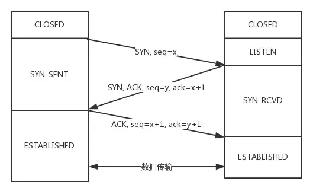

## TCP/IP面试题

### TCP和UDP的区别


### 建立连接三次握手





需要三次握手的原因是：需要确认双方的发送数据能力和接收能力。

服务端开始监听某个端口后进入 `Listen` 状态；

客户端主动发起连接，发送SYN，进入 `SYN-SENT` 状态；

服务端收到后，返回`SYN ` 和 `ACK` （对应客户端发来的SYN），自己变成 `SYN-REVD` ；

客户端收到服务端的SYN和ACK后再发送ACK给服务端，自己进入ESTABLISHED状态；

服务端收到ACK后也进入ESTABLISHED 状态；

连接建立。


**三次握手过程中可以携带数据吗？**

第三次握手可以携带，因为第三次握手的时候，客户端已经处于ESTABLISHED状态，并且能够确认服务器的接收和发送能力，这时比较安全，可以携带数据。


### 断开连接四次挥手


开始时双方都处于 ESTABLISHED 状态，客户端要断开连接，向服务端发送FIN报文，发送后客户端进入 FIN-WAIT-1状态，这时客户端也变成了half-close（半关闭）状态，即不能向服务端发送报文，只能接收；

服务端接收到客户端的FIN报文后，向客户端确认，变成CLOSE-WAIT 状态；

客户端接收到服务端的确认后变成FIN-WAIT-2状态；

随后，服务端向客户端发送FIN，自己进入LAST-ACK状态；

客户端收到服务端的FIN后，进入TIME-WAIT状态，然后发送ACK给服务端，这时，客户端需要等待2个MSL（报文最大生存时间），在这段时间内，如果客户端没有收到服务端的重发请求，那么表示ACK成功到达，挥手结束，否则，客户端重发ACK。


**为什么等待2个MSL？**

1个MSL确保四次挥手中主动关闭方最后的ACK报文最终能到达对端；1个MSL确保对端没有收到ACK重传的FIN报文可以到达。

如果不等待会怎样？

客户端直接断开，如果服务端还有很多数据包要发给客户端，客户端断开后此端口刚好又被新应用占用，那么会接收到无用数据包。


### TIME_WAIT状态产生的原因以及TIME_WAIT过多的解决

TIME_WAIT状态产生于tcp连接的四次挥手阶段，且产生于主动断开连接的一端；TIME_WAIT状态持续2个MSL时长；


**如何处理TIME_WAIT过多？**

在`/etc/sysctl.conf` 中添加以下参数

```shell
net.ipv4.tcp_syncookies = 1 #表示开启SYN Cookies。当出现SYN等待队列溢出时，启用cookies来处理，可防范少量SYN攻击，默认为0，表示关闭；
net.ipv4.tcp_tw_reuse = 1 #表示开启重用。允许将TIME-WAIT sockets重新用于新的TCP连接，默认为0，表示关闭；
net.ipv4.tcp_tw_recycle = 1 #表示开启TCP连接中TIME-WAIT sockets的快速回收，默认为0，表示关闭。
net.ipv4.tcp_fin_timeout #修改系默认的 TIMEOUT 时间
```

然后执行 /sbin/sysctl -p 让参数生效


### SYN Flood攻击原理

> 半连接队列
>
> 当客户端发送SYN到服务端，服务端收到以后回复ACK和SYN，状态由LISTEN变为SYN_RCVD，此时这个连接就被推入SYN队列，也就是半连接队列

> 全连接队列
>
> 当客户端返回ACK，服务端接收后，三次握手完成，这个时候连接等待被具体的应用取走，在被取走之前，会推入另一个TCP维护的队列，全连接队列（Accept Queue）


#### SYN Flood 攻击原理

SYN Flood属于典型的Dos/DDos攻击

攻击原理：用客户端在短时间内伪造大量不存在的IP地址，并向服务端疯狂发送SYN，对于服务端而言，会产生两个危险的后果：

1. 处理大量的SYN包并返回ACK，势必有大量连接处于SYN_RCVD状态，从而占满半连接队列，无法处理正常请求
2. 由于是不存在的IP，服务端长时间收不到客户端的ACK，导致服务端不断重发数据，直到耗尽服务端的资源

#### 应对SYN Flood攻击

1. 减少SYN连接，也就是增加半连接队列的容量
2. 减少SYN + ACK重试次数，避免大量的超时重发
3. 利用SYN Cookie 技术，在服务端接收到SYN后不立即分配连接资源，而是根据这个SYN计算出一个Cookie，连同第二次握手回复给客户端，在客户端回复ACK的时候带上这个Cookie值，服务端验证Cookie合法之后才分配连接资源


### 剖析TCP报文首部字段


### TCP快速打开（TFO）原理

> 使用SYN Cookie实现TFO

#### TFO流程

首轮三次握手

首先客户端发送SYN给服务端，服务端接收到，服务端根据这个SYN计算一个SYN Cookie，将这个Cookie放到TCP报文的 `Fast Open` 选项中，然后返回给客户端

客户端拿到这个Cookie的值缓存下来，后面完成正常三次握手


后面的三次握手

客户端将之前缓存的Cookie、SYN和HTTP请求发送给客户端，服务端验证Cookie的合法性，若不合法则丢弃，若合法就正常返回SYN+ACK

现在服务端可以向客户端法HTTP响应了（仅验证了Cookie的合法性就可以返回HTTP响应）

客户端第三次握手的ACK也要正常发送，且不一定要等收到服务端的HTTP响应才发送


#### TFO优势

优势并不在于首轮三次握手，而在于后面的握手，在拿到客户端的Cookie并验证通过后就可以返回HTTP响应，充分利用了一个RTT（Round-Trip Time，往返时延）的时间提前进行数据传输


### TCP时间戳的作用

>  timestamp是TCP报文首部一个可选项，占10字节
>
> 格式：kind（1字节）+length（1字节）+info（8个字节）
>
> info由两部分构成：timestamp、timestamp echo

TCP的时间戳主要解决两大问题:

* 计算往返时延RTT（Round-Trip Time）
* 防止序列号的回绕问题


### TCP超时重传算法


### TCP流量控制

对于发送端和接收端而言，TCP需要把发送的数据放到发送缓存区，接收的数据放到接收缓存区

流量控制要做的事，就是在通过接收缓存区的大小，控制发送端的发送，如果对方的接收缓存区满了，就不能继续发送了。


### TCP拥塞控制


### Nagle算法和延迟确认

#### Nagle算法，解决小包的频繁发送问题

Nagle算法的规则：

* 第一次发送数据时不用等待，即使是小包也立即发送

* 后面发送满足一下条件之一就可以发了：

  数据包大小达到最大段大小（Max Segment Size，MSS）

  之前所有包的ACK都已接收到


#### 延迟确认 （delayed）

场景：当收到发送端的一个包后，在极短的时间内又收到第二个包，那应该一个个回复还是稍微等一下把两个包的ACK合并一起回复呢？

延迟确认：稍微延迟，合并ACK，回复给发送端，TCP要求这个延迟的时延必须小于500ms

有些场景不能延迟确认：

* 收到一个大于frame的报文，且需要调整窗口大小
* TCP处于quickack模式（通过tcp_in_quickack_mode设置）
* 发现了乱序包


 


