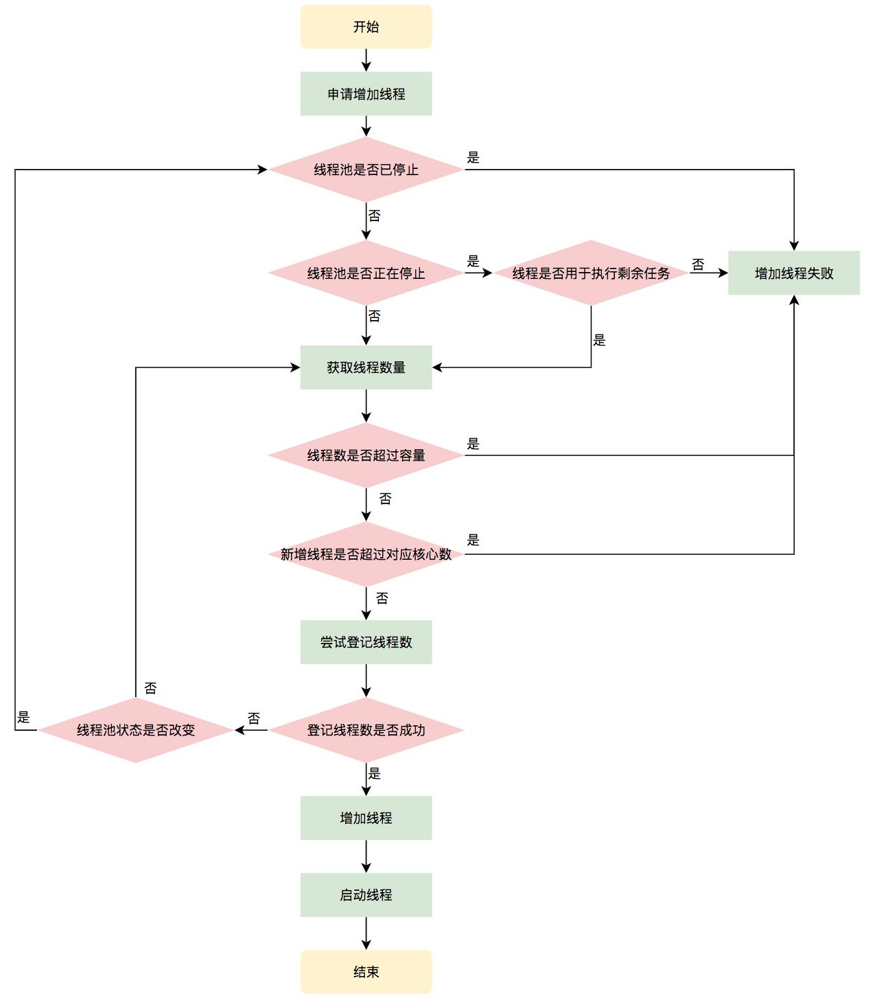

Java 线程池


线程池：是一种基于池化思想管理线程的工具

线程过多会带来额外的开销，其中包括创建销毁线程的开销、调度线程的开销等等，同时也降低了计算机的整体性能。线程池维护多个线程，等待监督管理者分配可并发执行的任务。这种做法，一方面避免了处理任务时创建销毁线程开销的代价，另一方面避免了线程数量膨胀导致的过分调度问题，保证了对内核的充分利用


> 线程池的好处：
>
> 降低资源消耗：通过池化技术重复利用已创建的线程，降低线程创建和销毁造成的损耗。
>
> 提高响应速度：任务到达时，无需等待线程创建即可立即执行。
>
> 提高线程的可管理性：线程是稀缺资源，如果无限制创建，不仅会消耗系统资源，还会因为线程的不合理分布导致资源调度失衡，降低系统的稳定性。使用线程池可以进行统一的分配、调优和监控。
>
> 提供更多更强大的功能：线程池具备可拓展性，允许开发人员向其中增加更多的功能。比如延时定时线程池ScheduledThreadPoolExecutor，就允许任务延期执行或定期执行。


顶层Executor：将任务提交和任务执行进行解耦

ExecutorService接口增加了一些能力：

1. 扩充执行任务的能力，补充可以为一个或一批异步任务生成Future的方法
2. 提供了管控线程池的方法，

AbstractExecutorService是上层的抽象类，将执行任务的流程串联了起来，保证下层的实现只需关注一个执行任务的方法即可

ThreadPoolExecutor：一方面维护自身的生命周期一方面管理线程和任务


ThreadPoolExecutor是如何运行，如何同时维护线程和执行任务的呢？

运行机制：


线程池在内部构建了一个生产者消费者模型，将线程和任务解耦，并不直接关联，从而良好的缓冲任务，复用线程；

线程池的运行主要分成两部分：任务管理、线程管理


线程池的生命周期管理

线程池内部使用一个变量维护两个值：运行状态（runState）和线程数量（workCount）

```java
private final AtomicInteger ctl = new AtomicInteger(ctlOf(RUNNING, 0));
```

**高3位保存runState，低29位保存workerCount **


用一个变量存储两个值，可避免在做相关决策时，出现不一致的情况，不必为了维护两者的一致占用锁资源

获取生命周期状态、获取线程池线程数量的计算方法

```java
private static int runStateOf(int c)     { return c & ~CAPACITY; } //计算当前运行状态
private static int workerCountOf(int c)  { return c & CAPACITY; }  //计算当前线程数量
private static int ctlOf(int rs, int wc) { return rs | wc; }   //通过状态和线程数生成ctl
```


ThreadPoolExecutor 的运行状态：


生命周期转换


任务执行机制

**任务调度**

所有任务调度都是由execute()方法完成：检查现在线程池的运行状态、运行线程数、运行策略，决定接下来执行的流程，是直接申请线程执行，或是缓冲到队列中执行，亦或是直接拒绝该任务


执行过程：

1. 首先检查线程池运行状态，如果不是RUNNING，则直接拒绝，线程池要保证在RUNNING的状态下执行
2. 如果workerCount < corePoolSize，则创建并启动一个线程来执行新提交的任务
3. 如果workerCount >= corePoolSize，且线程池内的阻塞队列未满，则将任务加到阻塞队列里
4. 如果workerCount >=corePoolSize && workerCount < maximumPoolSize，且线程池内的阻塞队列已满，则创建并启动一个线程来执行新提交的任务
5. 如果workerCount >= maximumPoolSize，并且线程池内的阻塞队列已满, 则根据拒绝策略来处理该任务, 默认的处理方式是直接抛异常。


执行流程


**任务缓冲**


阻塞队列(BlockingQueue)

在队列为空时，获取元素的线程会等待队列变为非空；当队列满时，存储元素的线程会等待队列有空位置

各种BlockingQueue


**任务申请**

一种是任务直接由新创建的线程执行；另一种是线程从任务队列中获取任务然后执行，执行完任务的空闲线程会再次去从队列中申请任务再去执行

帮助线程从阻塞队列中获取任务，实现线程管理模块和任务管理模块之间的通信，由getTask()方法实现


**任务拒绝**

当线程池的任务缓存队列已满，并且线程池中的线程数目达到maximumPoolSize时，就需要采取任务拒绝策略，拒绝掉该任务，保护线程池

```java
public interface RejectedExecutionHandler {
    void rejectedExecution(Runnable r, ThreadPoolExecutor executor);
}
```

可以通过实现这个接口定制拒绝策略，也可以使用JDK提供的四种拒绝策略


Worker线程管理


线程池需要管理线程的生命周期，需要在线程长时间不运行的时候进行回收。线程池使用一张Hash表去持有线程的引用，这样可以通过添加引用、移除引用这样的操作来控制线程的生命周期


Worker是通过继承AQS，使用AQS来实现独占锁这个功能。没有使用可重入锁ReentrantLock，为的就是实现不可重入的特性去反应线程现在的执行状态


1. lock方法一旦获取了独占锁，表示当前线程正在执行任务
2. 如果正在执行任务，则不应该中断线程
3. 如果该线程现在不是独占锁状态，也就是空闲状态，说明没有在处理任务，可以中断此线程
4. 线程池在执行shutdown方法或tryTerminate方法时会调用interruptIdleWorkers方法来中断空闲的线程，interruptIdleWorkers方法会使用tryLock方法来判断线程池中的线程是否是空闲状态；如果线程是空闲状态则可以安全回收。


interruptIdleWorkers方法流程：


Worker线程增加

addWorker()方法

不考虑线程池是在哪个阶段增加的线程，仅完成增加线程并使它运行，最后返回是否成功

参数：firstTask、core；firstTask参数用于指定新增的线程执行的第一个任务，该参数可以为空；core参数为true表示想要增加核心线程，在新增时会判断当前活动线程数是否少于corePoolSize，false表示想增加非核心线程，新增线程前需要判断当前活动线程数是否少于maximumPoolSize


增加线程的流程：




Worker线程回收

线程池中线程的销毁依赖JVM自动的回收，线程池的工作是根据当前线程池的状态维护一定数量的线程引用，防止这部分线程被JVM回收，当线程需要回收时，将引用消除即可；

Worker被创建出来后就会不断进行轮询，获取任务去执行，核心线程可以无限等待获取任务非核心线程限时获取任务；当worker获取到的任务为空时，循环结束，Worker主动消除自身在线程池内的引用

```java
try {
  while (task != null || (task = getTask()) != null) {
    //执行任务
  }
} finally {
  processWorkerExit(w, completedAbruptly);//获取不到任务时，主动回收自己
}
```

回收方法：`processWorkerExit(w, completedAbruptly)`


Worker线程执行任务

`runWorker()`

1.while循环不断地通过getTask()方法获取任务。

2.getTask()方法从阻塞队列中取任务。 

3.如果线程池正在停止，那么要保证当前线程是中断状态，否则要保证当前线程不是中断状态。

4.执行任务。

5.如果getTask结果为null则跳出循环，执行processWorkerExit()方法，销毁线程。

线程执行流程：


---

**线程池的构造函数参数**

`corePoolSize ` 核心线程数量

`maximumPoolSize`  最大线程数量

`keepAliveTime` 线程存活时间 

`unit ` 线程存活时间的单位

`workQueue` 阻塞队列

`threadFactory` 线程工厂

`handler` 拒绝策略		


提交新任务时，异常如何处理？

1. 在任务代码try/catch捕获异常

2. 通过Future对象的get方法接收抛出的异常

3. 为工作者线程设置UncaughtExceptionHandler，在UncaughtException方法中处理异常

   ```java
   ExecutorService threadPool = Executors.newFixedThreadPool(1, r -> {
               Thread t = new Thread(r);
               t.setUncaughtExceptionHandler(
                       (t1, e) -> {
                           System.out.println(t1.getName() + "线程抛出的异常"+e);
                       });
               return t;
              });
           threadPool.execute(()->{
               Object object = null;
               System.out.print("result## " + object.toString());
           });
   ```

   

4. 重写ThreadPoolExecutor的afterExecute方法，处理传递的异常引用

   ```java
   class ExtendedExecutor extends ThreadPoolExecutor {
       // 这可是jdk文档里面给的例子。。
       protected void afterExecute(Runnable r, Throwable t) {
           super.afterExecute(r, t);
           if (t == null && r instanceof Future<?>) {
               try {
                   Object result = ((Future<?>) r).get();
               } catch (CancellationException ce) {
                   t = ce;
               } catch (ExecutionException ee) {
                   t = ee.getCause();
               } catch (InterruptedException ie) {
                   Thread.currentThread().interrupt(); // ignore/reset
               }
           }
           if (t != null)
               System.out.println(t);
       }
   }}
   ```

   

线程池有哪几种工作队列？

* ArrayBlockingQueue

* LinkedBlockingQueue

* DelayQueue

  延迟队列：根据执行时间从小到大排序，newScheduledThreadPool使用这个队列

* PriorityBlockingQueue

  优先级队列：具有优先级的无界阻塞队列

* SynchronousQueue

  

几种常用的线程池

* newFixedThreadPool（固定数目线程的线程池）

  ```java
    public static ExecutorService newFixedThreadPool(int nThreads, ThreadFactory threadFactory) {
          return new ThreadPoolExecutor(nThreads, nThreads,
                                        0L, TimeUnit.MILLISECONDS,
                                        new LinkedBlockingQueue<Runnable>(),
                                        threadFactory);
      }
  ```

  特点：

  核心线程数和最大线程数大小一样；

  阻塞队列为无界队列LinkedBlockingQueue；

  keepAliveTime为0；

  场景：

  适用于处理CPU密集型的任务，确保CPU在长期被工作线程使用的情况下，尽可能少的分配线程，即适用执行长期的任务

  

  工作机制：

  

  如果线程数小于核销线程，创建核心线程执行任务；

  如果线程数等于核心线程，把任务添加到LinkedBlockingQueue阻塞队列；

  如果线程执行完任务，从阻塞队列取任务继续执行；

  

* newCachedThreadPool

  ```java
  public static ExecutorService newCachedThreadPool(ThreadFactory threadFactory) {
        return new ThreadPoolExecutor(0, Integer.MAX_VALUE,
                                        60L, TimeUnit.SECONDS,
                                        new SynchronousQueue<Runnable>(),
                                        threadFactory);
  }
  ```

  特点：

  核心线程数为0，最大线程数为Integer.MAX_VALUE；

  阻塞队列为SynchronousQueue；

  keepAliceTime（非核心线程空闲存活时间）为60秒；

  场景：并发执行大量短期的小任务

  

  工作机制：

  提交任务，因为没有核心线程，所以任务直接加到SynchronousQueue队列；

  判断是否有空闲线程，如果有，取任务执行，如果没有，新建线程；

  执行完任务的线程，存活60秒，如果在这期间接到任务，可以继续执行任务，否则被回收；

  

  

* newSingleThreadExecutor

  ```java
  public static ExecutorService newSingleThreadExecutor(ThreadFactory threadFactory) {
          return new FinalizableDelegatedExecutorService
              (new ThreadPoolExecutor(1, 1,
                                      0L, TimeUnit.MILLISECONDS,
                                      new LinkedBlockingQueue<Runnable>(),
                                      threadFactory));
  }
  ```

  核心线程数为1，最大线程数也为1；

  阻塞队列是LinkedBlockingQueue；

  keepAliveTime为0；

  

  工作机制：

  提交任务，判断线程池是否有一条线程，如果没有，新建线程执行任务；如果有，任务加到阻塞队列；

  

  

* newScheduledThreadPool

  ```java
  public ScheduledThreadPoolExecutor(int corePoolSize) {
          super(corePoolSize, Integer.MAX_VALUE, 0, NANOSECONDS,
                new DelayedWorkQueue());
  }
  ```

  特点：

  最大线程数为Integer.MAX_VALUE；

  阻塞队列是DelayedWorkQueue；

  keepAliveTime为0

  scheduleAtFixedRate()：按某种速率周期执行

  scheduleWithFixedDelay()：在某个延迟后执行

  

  工作机制：

  添加一个任务，线程池中的线程从DelayedQueue中取任务；

  线程获取time>=当前时间的task；

  执行完后修改这个task的time为下次被执行的时间；

  这个task放回DelayedQueue中

  

线程池的状态切换


