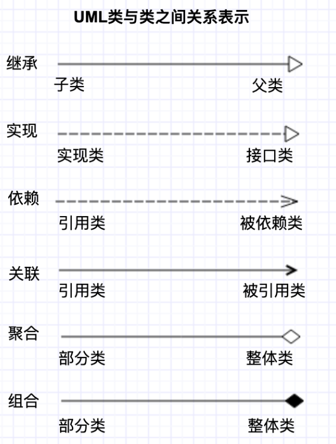
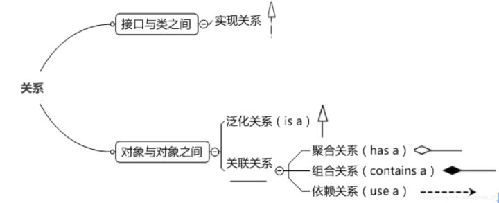

UML类图

使用包含类名、属性（field）和方法（method）且带有分割线的矩形来表示类

表示可见性的符号有三种：

+：public

-：private

#：protected （缺省（friendly）也归入这类）

属性的表示方式：可见性 名称 : 类型 [ =缺省值 ]

方法的表示方式：可见性 名称(参数列表) [:返回类型 ]

类与类之间关系的表示方式

* 关联关系

  * 单向关联

    让A类持有一个类型为B的成员变量类

  * 双向关联

    A类中有B类型的成员变量，B类中有A类型的成员变量

  * 自关联

    自己包含自己

* 聚合关系

  用带空心菱形和箭头的直线表示

  聚合关系强调“整体”包含“部分”，但是“部分”可以脱离“整体”单独存在

* 组合关系

  用带实心菱形和箭头的直线表示

  强调“部分”脱离“整体”就不复存在

* 依赖关系

  用带有箭头的虚线表示

* 继承关系

  对应 `extends ` 关键字，用带空心三角形的直线表示

* 接口实现关系

  对应 `implement` 关键字，用带空心三角形的虚线表示

