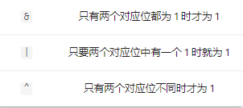

位运算

> 基于整数的二进制表示进行的运算

常见运算符：与（&）、或（|）、异或（^）、取反（~）、左移（<<）、右移（>>）


与、或、异或

两数之间的运算



> 异或的逆运算是它本身，也就是两次异或同一个数最后结果不变


取反 `~`

> 取反是单目运算，即对一个数num进行的计算

把num的补码全部取反（0变1，1变0），有符号整数的符号位在取反运算中同样会取反

补码：二进制表示下，正数和0的补码是其本身，负数的补码是将对应正数按位取反后加1


左移、右移

`num << i` 表示num的二进制向左移动i位的值；

`num << i` 表示num的二进制向右移动i位的值

> 若右移的移位数（右操作数）为负值或右移的移位数（右操作数）大于等于左操作数的位数，则行为无效；
>
> 比如，对于int类型的变量a，a << -1 和 a<< 32都是无效（未定义）的；
>
> 对一个负数左移也未定义；
>
> 对于右移操作，右侧多余的位将被舍弃，左侧：对于无符号数，左侧补0，对于有符号数，则会用最高位的数（其实就是符号位，非负数为0，负数为1）补齐


`n << m` 相当于 `n * (2^m)` 乘2的非负整数次幂

`n >> m` 相当于 `n / (2^m)` 除以2的非负整数次幂

 

交换两个数

```java
a ^= b;
b ^= a;
a ^= b;
```


