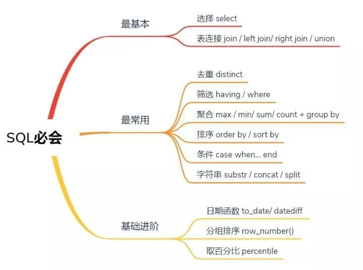

### 基础



表连接


函数

`CAST()函数` CAST函数用于将某种数据类型的表达式显式转换为另一种数据类型，用as隔开

 ```
CAST(salary as float)
 ```


`CONCAT()` **CONCAT** 函数用于将两个字符串连接为一个字符串

```
select concat('Hello ','World') from dual;
```


`split(str, regex)` 用于将string类型数据按regex提取，分隔后转换为array

```sql
Select split("1,2,3",",")as value_array from table_1;
```

```sql
select value_array[0],value_array[1],value_array[2] from 
(select  split("1,2,3",",")as value_array from table_1 )t
```


**排序函数：row_number()、rank() 、dense_rank()**


`row_number() over()  ` row_number()从1开始，为每一条分组记录返回一个数字

>  则在排序相同时不重复，会根据顺序排序


```sql
-- 按照salary倒序编号
select *, row_number() over (order by salary desc)  as rownum from table_1;
-- 按照 deptid 分组后再按照 salary 倒序编号
select *, row_number() over (partition by deptid order by salary desc) as rank from table_1;
```


`rank() ` rank()排序相同时会重复，总数不会变 ，意思是会出现1、1、3这样的排序结果

> 并列第一，下一个是第三


`dense_rank() ` 排序相同时会重复，总数会减少，意思是会出现1、1、2这样的排序结果

> 并列第一，下一个是第二


`percentile()` 百分位函数

```sql
-- 获取income字段的top10%的阈值
select percentile(CAST (salary AS int),0.9)) as income_top10p_threshold from table_1;

-- 获取income字段的10个百分位点
select percentile(CAST (salary AS int),array(0.0,0.1,0.2,0.3,0.4,0.5,0.6,0.7,0.8,0.9,1.0)) as income_percentiles
from table_1;
```


```sql
-- 计算数据到当前的天数差
datediff('2016-12-30','2016-12-29');
```


##### 查询表中的重复数据

```sql
select Email 
from Person 
group by Email
having count(*) >1
```


```sql
2、删除表中多余的重复记录，重复记录是根据单个字段（Id）来判断，只留有rowid最小的记录
DELETE 
from 表 WHERE (id) IN ( SELECT id FROM 表 GROUP BY id HAVING COUNT(id) > 1) AND 
ROWID NOT IN (SELECT MIN(ROWID) FROM 表 GROUP BY id HAVING COUNT(*) > 
1);
```


